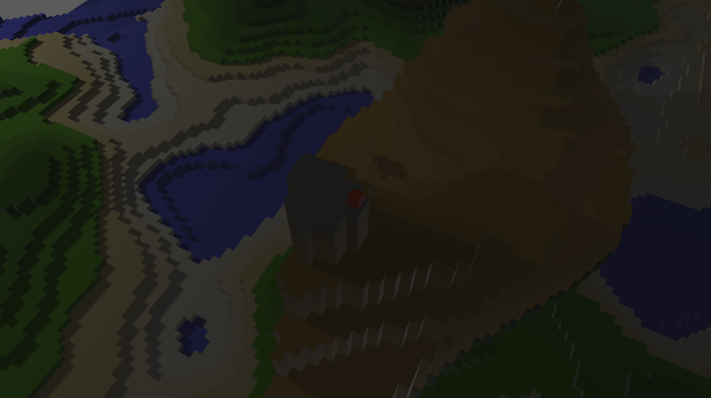

# Minimum Crappy Playable 5

* Experimental cross-platform 3d game powered by [bevy](https://github.com/bevyengine/bevy) + [bevy_rapier](https://github.com/dimforge/bevy_rapier)
* Provides huge map with procedural generation

## Demo

https://yushiomote.github.io/mcp5/

Keys:

- W/A/S/D - Walk
- J - Jump
- K - Run

